# SpectralRank Agent 交互流程图

## 完整交互流程

```mermaid
graph TD
    Start([用户访问页面]) --> CheckMode{选择模式}
    CheckMode -->|Agent模式| AgentMode[Agent模式界面]
    CheckMode -->|Manual模式| ManualMode[Manual模式界面]
    
    AgentMode --> UploadChoice{文件上传方式}
    UploadChoice -->|上传文件| UploadFile[用户选择CSV文件]
    UploadChoice -->|加载示例| LoadExample[选择示例数据集]
    
    UploadFile --> ValidateFile{验证文件}
    ValidateFile -->|格式错误| Error1[显示错误消息]
    ValidateFile -->|文件过大| Error2[显示错误消息]
    ValidateFile -->|验证通过| UploadToBackend[POST /api/agent/upload]
    
    LoadExample --> LoadFromBackend[POST /api/agent/load-example]
    
    UploadToBackend --> SaveFile[后端保存文件到agent_uploads目录]
    LoadFromBackend --> SaveFile
    
    SaveFile --> ReturnFileId[返回file_id]
    ReturnFileId --> UpdateUI[更新前端UI状态]
    UpdateUI --> ShowStatusPanel[显示状态面板]
    ShowStatusPanel --> TriggerAnalysis[触发初始分析请求]
    
    TriggerAnalysis --> SendInitialRequest[调用send_initial_analysis_request]
    SendInitialRequest --> PrepareMessages[准备消息上下文]
    PrepareMessages --> CallChatAPI[POST /api/agent/chat]
    
    CallChatAPI --> BackendChat[后端agent_chat函数]
    BackendChat --> BuildMessages[构建消息列表<br/>添加SYSTEM_PROMPT]
    BuildMessages --> CallOpenAI[调用_call_openai<br/>请求OpenAI API]
    
    CallOpenAI --> LLMDecision{LLM决策}
    LLMDecision -->|需要工具调用| ToolCalls[LLM返回tool_calls]
    LLMDecision -->|直接回复| DirectResponse[返回文本回复]
    
    ToolCalls --> DispatchTool[调用_dispatch_tool_call_with_retry_phase1<br/>Phase 1优化版本]
    DispatchTool --> CheckDependencies{检查工具依赖<br/>TOOL_DEPENDENCIES_PHASE1}
    CheckDependencies -->|依赖满足| ToolChoice{选择工具<br/>按优先级排序}
    CheckDependencies -->|依赖不满足| SkipTool[跳过工具<br/>等待后续调用]
    
    ToolChoice -->|inspect_dataset| InspectDataset[检查数据集结构<br/>分析列、缺失值、数值列]
    ToolChoice -->|infer_direction| InferDirection[推断排名方向<br/>higher/lower]
    ToolChoice -->|estimate_runtime| EstimateRuntime[估算运行时间]
    ToolChoice -->|create_job| CreateJob[创建排名任务]
    ToolChoice -->|poll_status| PollStatus[轮询任务状态]
    ToolChoice -->|get_results| GetResults[获取排名结果]
    
    InspectDataset --> ToolResult[返回工具结果<br/>包含数据集统计信息]
    InferDirection --> ToolResult[返回方向推断结果<br/>higher/lower + 置信度]
    EstimateRuntime --> ToolResult[返回时间估算结果<br/>eta_seconds + eta_formatted]
    
    ToolResult --> AppendToMessages[将结果追加到消息列表]
    AppendToMessages --> CheckPhase1Complete{检查Phase 1完成?<br/>_check_phase1_complete}
    CheckPhase1Complete -->|已完成| ReturnResponse[提前返回<br/>Phase 1完成]
    CheckPhase1Complete -->|未完成| LoopCheck{是否还有工具调用?}
    LoopCheck -->|是| CallOpenAI
    LoopCheck -->|否| CheckMaxIterations{达到最大迭代次数?}
    CheckMaxIterations -->|未达到| CallOpenAI
    CheckMaxIterations -->|已达到| ReturnResponse[返回完整响应]
    
    DirectResponse --> ReturnResponse
    ReturnResponse --> ProcessResponse[前端处理响应]
    
    ProcessResponse --> ParseToolResults[解析工具结果]
    ParseToolResults --> ExtractJobId[检查create_job工具调用<br/>从工具结果中提取job_id]
    ExtractJobId --> UpdateContext[更新agent_context<br/>data_insights]
    UpdateContext --> CheckForJobId{检测到job_id?}
    
    CheckForJobId -->|检测到job_id| PollJobStatusAsync[调用check_agent_job_status<br/>异步轮询任务状态<br/>GET /api/ranking/jobs/job_id/status]
    CheckForJobId -->|无job_id| ShowWorkflowModal{显示工作流模态框?}
    
    ShowWorkflowModal -->|有数据洞察| DisplayModal[显示工作流配置模态框<br/>展示数据预览、方向、参数]
    ShowWorkflowModal -->|无数据洞察| DisplayMessage[显示LLM文本回复]
    
    DisplayModal --> UserConfirm{用户确认参数}
    UserConfirm -->|确认并开始| StartRanking[调用direct_agent_analysis]
    UserConfirm -->|取消/修改| DisplayModal
    
    StartRanking --> GetFileContent[GET /api/agent/files/file_id<br/>获取文件内容]
    GetFileContent --> CreateJobDirect[POST /api/ranking/jobs<br/>直接创建排名任务<br/>使用默认参数]
    CreateJobDirect --> StoreJobIdDirect[存储job_id]
    StoreJobIdDirect --> PollStatusDirect[调用poll_status_async<br/>同步轮询任务状态]
    
    PollStatusDirect --> CheckStatusDirect{任务状态}
    CheckStatusDirect -->|running| WaitDirect[等待并继续轮询]
    CheckStatusDirect -->|failed| ShowError
    CheckStatusDirect -->|succeeded| FetchResultsDirect[调用fetch_results_async<br/>获取结果]
    
    WaitDirect --> PollStatusDirect
    
    FetchResultsDirect --> DisplayReport
    
    CreateJob --> CreateRankingJob[工具内部调用<br/>POST /api/ranking/jobs<br/>创建后台任务]
    CreateRankingJob --> ReturnJobId[返回job_id<br/>在工具结果中]
    ReturnJobId --> ToolResult
    
    CreateRankingJob --> BackgroundTask[后台执行R脚本排名分析<br/>run_ranking_script]
    BackgroundTask --> UpdateJobStatus[更新任务状态到status.json]
    UpdateJobStatus --> PollJobStatusAsync
    
    PollJobStatusAsync --> CheckStatusAsync{任务状态}
    CheckStatusAsync -->|running| WaitAsync[等待并继续轮询<br/>定时器2秒后重试]
    CheckStatusAsync -->|failed| ShowError
    CheckStatusAsync -->|succeeded| FetchResultsAsync[GET /api/ranking/jobs/job_id/results<br/>获取结果]
    
    WaitAsync --> PollJobStatusAsync
    
    FetchResultsAsync --> ParseResults[解析排名结果JSON]
    ParseResults --> DisplayReport[显示排名报告<br/>表格、图表、统计信息]
    
    DisplayMessage --> UserInput{用户输入消息}
    UserInput -->|继续对话| SendMessage[调用send_agent_message]
    UserInput -->|重置| ResetState[重置状态]
    
    SendMessage --> ValidateInput[验证输入和API密钥]
    ValidateInput -->|验证失败| ShowValidationError[显示验证错误]
    ValidateInput -->|验证通过| PrepareUserMessage[准备用户消息]
    
    PrepareUserMessage --> AddContext[添加上下文信息<br/>工作流阶段、数据洞察]
    AddContext --> CallChatAPI
    
    ResetState --> AgentMode
    
    ShowError --> End([结束])
    DisplayReport --> End
    ShowValidationError --> UserInput
    
    style Start fill:#e1f5ff
    style End fill:#ffe1e1
    style CallOpenAI fill:#fff4e1
    style ToolCalls fill:#e1ffe1
    style DisplayReport fill:#e1e1ff
    style BackgroundTask fill:#ffe1f5
```



## 关键组件说明

### 前端主要函数
- `handle_agent_file_upload()` - 处理文件上传
- `handle_example_data_load()` - 加载示例数据
- `send_initial_analysis_request()` - 发送初始分析请求
- `send_agent_message()` - 发送用户消息
- `process_agent_analysis_async()` - 处理分析结果
- `direct_agent_analysis()` - 直接执行排名分析
- `show_workflow_modal()` - 显示工作流配置模态框
- `check_agent_job_status()` - 检查任务状态

### 后端主要函数
- `/api/agent/upload` - 文件上传端点
- `/api/agent/load-example` - 加载示例数据端点
- `/api/agent/chat` - 核心聊天端点
- `agent_chat()` - 聊天处理函数
- `_call_openai()` - 调用OpenAI API
- `_dispatch_tool_call()` - 工具调用分发器

### Agent工具集（Phase 1优化后）
1. **inspect_dataset** - 检查数据集结构、列、缺失值 ✅ 已优化
2. **infer_direction** - 推断排名方向（higher/lower）✅ 已优化
3. **estimate_runtime** - 估算分析运行时间 ✅ 已优化
4. **create_job** - 创建排名分析任务
5. **poll_status** - 轮询任务状态
6. **get_results** - 获取排名结果

### Phase 1优化特性
- **工具依赖检查**：确保inspect_dataset → infer_direction → estimate_runtime的执行顺序
- **智能参数填充**：从inspect_dataset结果自动传递参数给后续工具
- **错误处理和重试**：分类错误类型，实现重试机制
- **结果验证**：验证每个工具返回结果的结构有效性
- **智能循环终止**：检测Phase 1完成时提前终止

### 工作流阶段
1. **awaiting_upload** - 等待文件上传
2. **data_analysis** - 数据分析阶段
3. **analysis_running** - 分析运行中
4. **results_ready** - 结果就绪

## 数据流

```
用户输入 → 前端验证 → API调用 → 后端处理 → OpenAI API → 工具执行 → 结果返回 → UI更新
```

## 状态管理

前端使用 `client_state` 管理：
- `current_agent_file_id` - 当前上传的文件ID
- `current_agent_job_id` - 当前运行的任务ID
- `agent_conversation_history` - 对话历史
- `agent_context` - Agent上下文（数据洞察、工作流阶段等）

